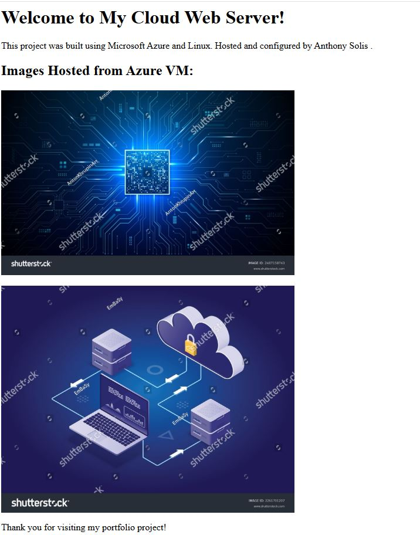
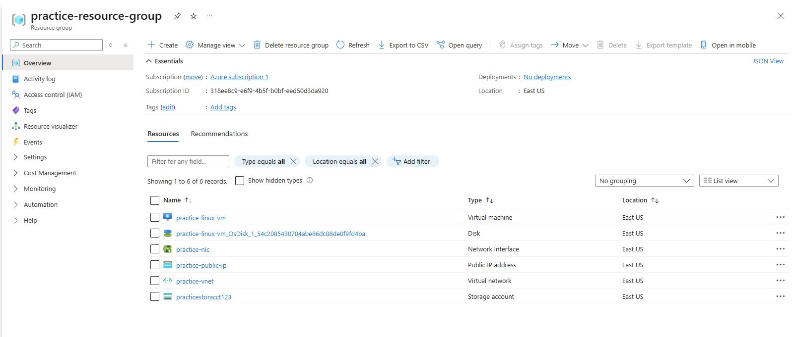
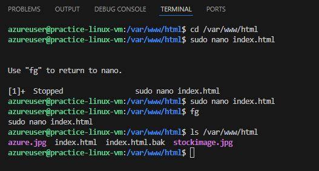
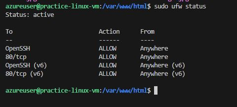

# Azure Linux Web Server Deployment

## Project Overview
This project creates a Linux VM on Azure, installs Apache, hosts a custom website, and secures the server using UFW firewall.

## Skills Demonstrated
- Azure CLI and Azure Portal usage
- Linux Server setup and security
- Apache Web Server configuration
- SCP for file transfer
- UFW firewall configuration
- Python automation of Azure resources (starter level)

## Technologies Used
- Azure Cloud
- Ubuntu Linux
- Apache2
- Python 3
- Azure SDK for Python
- GitHub

## Screenshots

### Website Screenshot

### Azure Portal Screenshot

### SSH Terminal Screenshot

### UFW Firewall Status Screenshot

## How to Recreate
1. Create Resource Group
2. Create Virtual Network and NIC
3. Deploy Linux VM
4. SSH into VM
5. Install Apache and configure website
6. Secure server with UFW
7. Upload images and update web page
